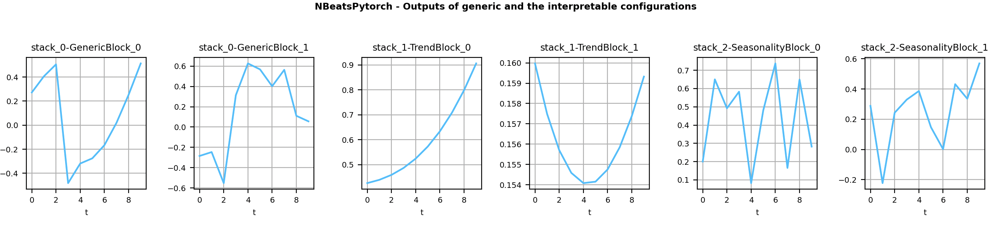
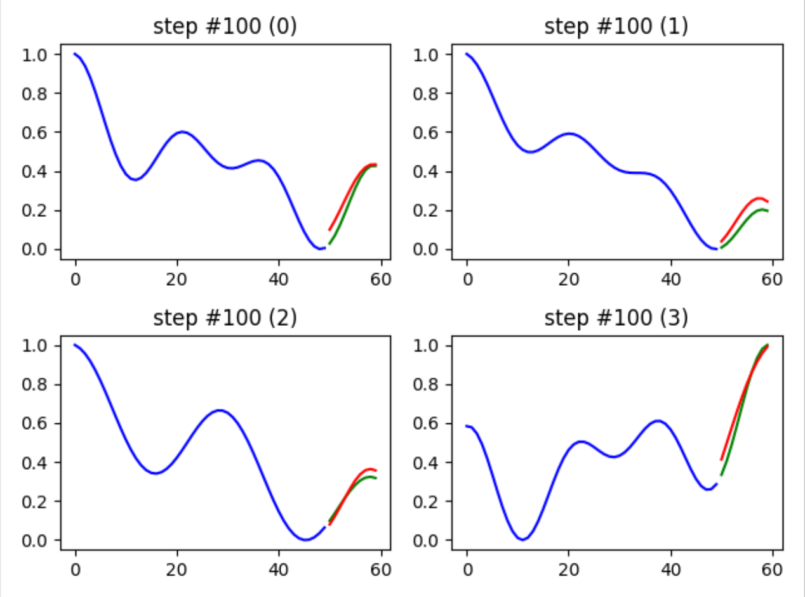

## NBEATS<br/>Neural basis expansion analysis for interpretable time series forecasting

Tensorflow/Pytorch implementation | [Paper](https://arxiv.org/abs/1905.10437)
| [Results](https://github.com/fecet/NBeats-M4)


<p align="center">
  <br/>
  <i>Outputs of the generic and interpretable layers</i>
</p>

### Installation

It is possible to install the two backends at the same time.

#### From PyPI

Install the Tensorflow/Keras backend: `pip install nbeats-keras`

[](https://pepy.tech/project/nbeats-keras)

Install the Pytorch backend: `pip install nbeats-pytorch`

[](https://pepy.tech/project/nbeats-pytorch)

#### From the sources

Installation is based on a MakeFile.

Command to install N-Beats with Keras: `make install-keras`

Command to install N-Beats with Pytorch: `make install-pytorch`

#### Run on the GPU

It is possible that this is no longer necessary on the recent versions of Tensorflow.  To force the utilization of the GPU (with the Keras backend),
run: `pip uninstall -y tensorflow && pip install tensorflow-gpu`. 

### Example

Here is an example to get familiar with both backends. Note that only the Keras backend supports `input_dim>1` at the moment.

```python
import warnings

import numpy as np

from nbeats_keras.model import NBeatsNet as NBeatsKeras
from nbeats_pytorch.model import NBeatsNet as NBeatsPytorch

warnings.filterwarnings(action='ignore', message='Setting attributes')


def main():
    # https://keras.io/layers/recurrent/
    # At the moment only Keras supports input_dim > 1. In the original paper, input_dim=1.
    num_samples, time_steps, input_dim, output_dim = 50_000, 10, 1, 1

    # This example is for both Keras and Pytorch. In practice, choose the one you prefer.
    for BackendType in [NBeatsKeras, NBeatsPytorch]:
        # NOTE: If you choose the Keras backend with input_dim>1, you have 
        # to set the value here too (in the constructor).
        backend = BackendType(
            backcast_length=time_steps, forecast_length=output_dim,
            stack_types=(NBeatsKeras.GENERIC_BLOCK, NBeatsKeras.GENERIC_BLOCK),
            nb_blocks_per_stack=2, thetas_dim=(4, 4), share_weights_in_stack=True,
            hidden_layer_units=64
        )

        # Definition of the objective function and the optimizer.
        backend.compile(loss='mae', optimizer='adam')

        # Definition of the data. The problem to solve is to find f such as | f(x) - y | -> 0.
        # where f = np.mean.
        x = np.random.uniform(size=(num_samples, time_steps, input_dim))
        y = np.mean(x, axis=1, keepdims=True)

        # Split data into training and testing datasets.
        c = num_samples // 10
        x_train, y_train, x_test, y_test = x[c:], y[c:], x[:c], y[:c]
        test_size = len(x_test)

        # Train the model.
        print('Training...')
        backend.fit(x_train, y_train, validation_data=(x_test, y_test), epochs=20, batch_size=128)

        # Save the model for later.
        backend.save('n_beats_model.h5')

        # Predict on the testing set (forecast).
        predictions_forecast = backend.predict(x_test)
        np.testing.assert_equal(predictions_forecast.shape, (test_size, backend.forecast_length, output_dim))

        # Predict on the testing set (backcast).
        predictions_backcast = backend.predict(x_test, return_backcast=True)
        np.testing.assert_equal(predictions_backcast.shape, (test_size, backend.backcast_length, output_dim))

        # Load the model.
        model_2 = BackendType.load('n_beats_model.h5')

        np.testing.assert_almost_equal(predictions_forecast, model_2.predict(x_test))


if __name__ == '__main__':
    main()
```

Browse the [examples](examples) for more. It includes Jupyter notebooks.

Jupyter notebook: [NBeats.ipynb](examples/NBeats.ipynb): `make run-jupyter`.

<p align="center">
  <br/>
</p>

### Citation

```
@misc{NBeatsPRemy,
  author = {Philippe Remy},
  title = {N-BEATS: Neural basis expansion analysis for interpretable time series forecasting},
  year = {2020},
  publisher = {GitHub},
  journal = {GitHub repository},
  howpublished = {\url{https://github.com/philipperemy/n-beats}},
}
```

### Contributors

Thank you!

<a href="https://github.com/philipperemy/n-beats/graphs/contributors">
  
</a>
